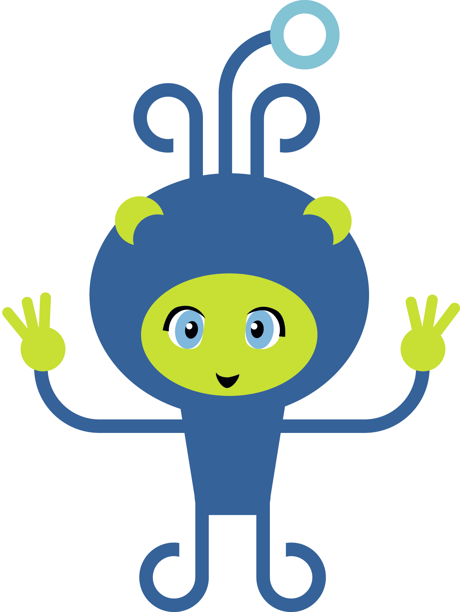
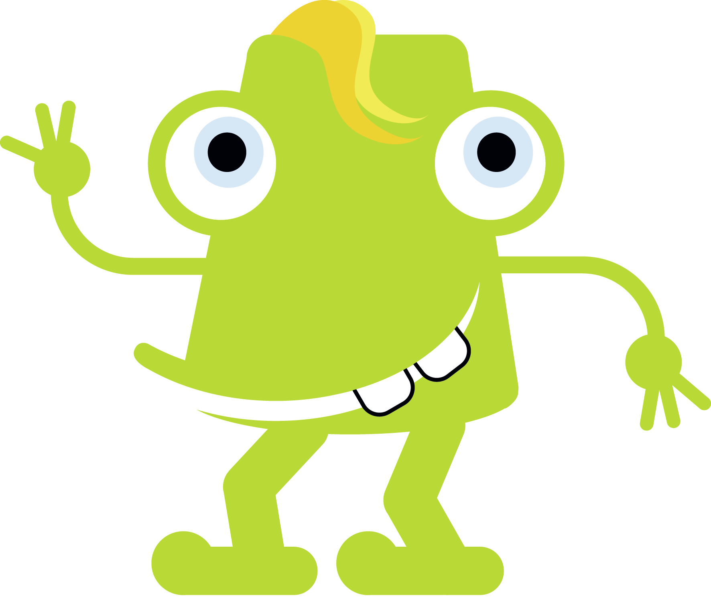

Overview
-------------------------------
Source code
~~~~~~~~~~~~~~~~~~~~~~~~~~~~~~~
pailab's source code is available on GitHub:

https://github.com/pailabteam/pailab

and cloned using::

    git clone https://github.com/pailabteam/pailab.git pailab

Examples and first steps
~~~~~~~~~~~~~~~~~~~~~~~~~~~~~~~~~~~~~~~~
To learn how to work with pailab you may find the :ref:`overall_tutorial` useful. 
In addition, you find jupyter notebooks in the examples directory.

Laby and Bugy
~~~~~~~~~~~~~~~~~~~~~~~~~~~~~~~
During a trans-universal trip in 2500 Laby and Bugy made a stop on earth.
They were quite astonished to see how far humans 
had developed the AI business but they got a little frightened when they saw how blind-folded humans worked in this business. At least Laby would have not been 
far from a heart attack if he would have had a thing we humans might call heart. They soon decided to help these poor underdeveloped 
human species and to make a little time travel to the beginning of the AI bubble. So, when they arrived in January 2019, they started to 
develop pailab. 

They form quite a good team, complementing each other. Laby fights each bug with her weapons brought from her home planet Labmania, 
documenting everything (Bugy had to put a lot of effort convincing her not to document the documentation) and producing code
passing all beautifiers for all styleguids without being changed (and has overruled Chuck Norris since his code was not matlab compliant). 
She is really enthusiastic about testing.

Bugy is more the chaotic but creative alien. He loves to produce many new functionalities and hates documenting. He has not understand the
sense of measuring test coverage but he may implement a better Powerpoint application then the one implemented by his cousin Bugsy 
(who uses the initials MS for whatever reason) with maybe three lines of code 
(if we count his comment to understand his program the source code file might have four lines).

|laby| Laby and |bugy| Bugy
